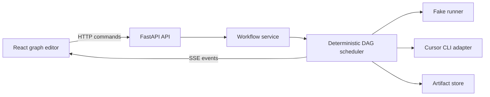
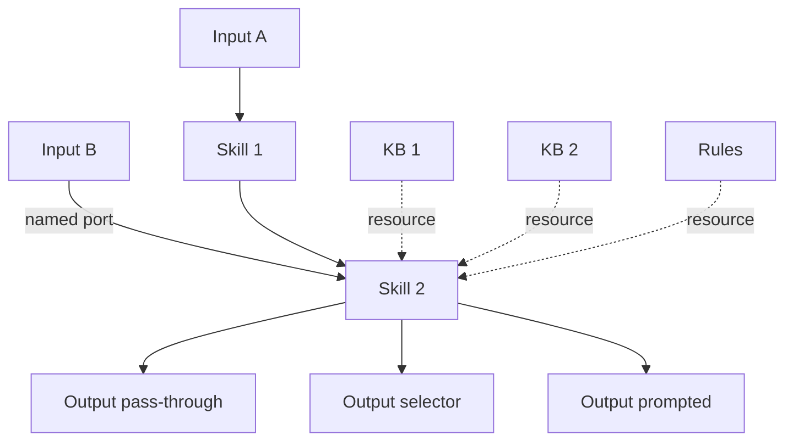

# Mitos Flow — Master Plan

> **Purpose of this document:** Single source of truth for what Mitos Flow is, how it should be built, and which phase is done. Update checkboxes as phases complete. Point every implementation chat at this file first.

**Last updated:** 2026-08-01  
**Current phase:** 31 (complete — v1 baseline)  
**Stack:** Local React/Vite frontend + FastAPI backend · Cursor CLI first · Fake runner before real CLI

---

## What we are building

Mitos Flow is a **visual AI workflow builder** — a drag-and-drop canvas where users chain local AI engines (starting with Cursor CLI) into executable automation flows.

Users already have **skills** and **rules** in Cursor or Copilot. Mitos should let them drag those blocks onto a canvas, wire them together, attach knowledge bases and rules, run the flow, and observe data moving through it.

### Core product ideas (frozen for v1)

| Concept | Decision |
| --- | --- |
| **Node kinds** | Input, Skill, Knowledge Base, Rules, Artifact Output |
| **Edge kinds** | **Data-flow** (solid) — moves payloads between nodes; **Resource attachment** (dashed) — attaches KB/Rules/Prompts to Skills or Outputs |
| **KB attachments** | Many-to-many: one KB → many Skills, many KBs → one Skill |
| **Rules attachments** | Many-to-many: one Rules node → many Skills, many Rules → one Skill |
| **Multiple inputs** | Named input ports on Skills; inputs can attach at multiple points in the graph |
| **Join policy (v1)** | `wait_for_all` only — Skill runs once every required input is ready |
| **Output = Save** | One **Artifact Output** node replaces separate Save and Output nodes |
| **Output modes** | Pass-through (free), deterministic selector (free), prompted projection (paid model call) |
| **Execution order** | Deterministic DAG scheduler; **cycles rejected in v1** |
| **Runner strategy** | Fake deterministic runner first; Cursor CLI adapter only after scheduler is stable |
| **Live UX** | Animate data on active edges; show run trace (not hidden chain-of-thought); tokens + estimated cost |
| **Import** | Drag/drop Cursor/Copilot skill and rule files into a managed local library |

### Architecture diagram



### Graph semantics (target state)



---

## How to use this plan across chats

### Before starting any phase

1. Read this file (`MASTER-PLAN.md`).
2. Read `docs/implementation-status.md` (created in Phase 0).
3. Implement **only the next unchecked phase**.
4. Do not refactor unrelated code or jump ahead.
5. Stop at the phase acceptance gate.

### After completing a phase

1. Run automated tests for that phase.
2. Perform the manual check listed in the phase.
3. Check off the phase below (`[ ]` → `[x]`).
4. Update **Current phase** and **Last updated** at the top of this file.
5. Append notes to `docs/implementation-status.md`.

### Prompt template for a new chat

```
Implement Mitos Flow Phase N only.

Read first:
- MASTER-PLAN.md (repo root)
- docs/implementation-status.md

Rules:
- Implement only Phase N
- Do not refactor unrelated code
- Add/update tests required by the phase gate
- Update MASTER-PLAN.md checkbox and docs/implementation-status.md when done
- Stop at the acceptance gate
```

---

## Operating rules (every phase)

- One phase = one separate chat.
- Each phase ends with: **automated tests passing**, **one documented manual check**, **status docs updated**.
- Use **npm** for frontend, **Python pyproject.toml** for backend.
- Install current compatible package versions via package managers; do not pin guessed versions.
- Defer everything listed under [Deferred beyond Phase 31](#deferred-beyond-phase-31).

---

## Milestone tracker

| Milestone | Phases | Status |
| --- | --- | --- |
| Foundation | 0–3 | [x] |
| Graph editor | 4–8 | [x] |
| Shared workflow model | 9–10 | [x] |
| Deterministic execution | 11–16 | [x] |
| Reusable local assets | 17–20 | [x] |
| Regression harness | 20.5 | [x] |
| Cursor CLI adapter | 21–24 | [x] |
| Per-Skill Cursor models | 24.5 | [x] |
| Artifact outputs & observability | 25–28 | [x] |
| Skill library apply + dual handles | 28.5 | [x] |
| Portability & hardening | 29–31 | [x] |

---

## Phase checklist

### Foundation

- [x] **Phase 0 — Freeze contracts and phase gates**
  - Create `docs/architecture.md`, `docs/phases.md`, `docs/implementation-status.md`
  - Record node kinds, edge kinds, join policies, `InputEnvelope`, output modes, v1 non-goals
  - **Gate:** Docs have no unresolved choices for Phases 1–5; no application code yet
  - **Manual check:** Another reader can implement Phase 1 from docs alone

- [x] **Phase 1 — Backend health service**
  - Create `backend/pyproject.toml`, `backend/src/mitos_api/main.py`, health-route test
  - Implement only `GET /api/health` → `{"status":"ok"}`
  - **Gate:** `pytest` passes; endpoint responds locally
  - **Manual check:** `curl http://localhost:8000/api/health` returns OK

- [x] **Phase 2 — Frontend shell**
  - Scaffold `frontend/` with Vite, React, TypeScript, Vitest, React Testing Library
  - Render Mitos header, empty workspace, backend connection status (no graph yet)
  - **Gate:** Component test passes; page shows backend connected
  - **Manual check:** Browser shows green/connected status against running backend

- [x] **Phase 3 — Unified local development command**
  - Add root dev scripts and `README.md` Windows instructions
  - Configure dev CORS and environment-based API URL
  - **Gate:** One command starts both services; refresh and shutdown are clean
  - **Manual check:** `npm run dev` (or equivalent) starts frontend + backend together

---

### Graph editor

- [x] **Phase 4 — Read-only sample canvas**
  - Add `@xyflow/react`; render fixed Input → Skill → Artifact Output graph
  - Create minimal custom nodes under `frontend/src/features/graph/nodes/`
  - **Gate:** Graph renders, pans, zooms; no editing controls
  - **Manual check:** Sample graph visible and interactive (pan/zoom only)

- [x] **Phase 5 — Add, select, move, and delete nodes**
  - Node palette for all five node kinds
  - Selection, movement, deletion only; settings remain fixed
  - **Gate:** UI tests for add/delete; refresh confirms state not persisted yet
  - **Manual check:** Add and delete nodes; reload clears canvas

- [x] **Phase 6 — Typed edges and connection rules**
  - Solid data edges + dashed resource-attachment edges
  - Enforce allowed connections; reject self-links and invalid direction
  - **Gate:** Connection-validator unit tests cover every allowed/rejected pair
  - **Manual check:** Invalid connections are blocked in UI with clear feedback

- [x] **Phase 7 — Node inspector and editable labels**
  - Side inspector with node name and kind-specific fields
  - Changes stay in frontend memory
  - **Gate:** Edit/select tests pass; nodes do not cross-mutate
  - **Manual check:** Edit a node label; select another node; first node unchanged

- [x] **Phase 8 — Local draft persistence**
  - Versioned browser-local draft schema; New Workflow and Reset Draft with confirmations
  - **Gate:** Reload restores positions/settings; corrupt data falls back with warning
  - **Manual check:** Build graph, reload page, graph restored

---

### Shared workflow model

- [x] **Phase 9 — Backend workflow schema**
  - Pydantic models in `backend/src/mitos_api/domain/` for nodes, edges, ports, metadata
  - `POST /api/workflows/validate` only (no save, no execute)
  - **Gate:** Fixtures for valid graphs, cycles, dangling edges, duplicate IDs, invalid edge kinds
  - **Manual check:** POST a sample workflow JSON; receive validation result

- [x] **Phase 10 — Frontend/backend schema round-trip**
  - Matching TypeScript domain types and API serialization
  - Explicit mapping from UI graph shapes to domain model
  - **Gate:** Representative workflow validates via API without losing settings
  - **Manual check:** Export graph from UI → validate via API → settings intact

---

### Deterministic execution first

- [x] **Phase 11 — Fake runner for one Skill**
  - Runner interface + deterministic fake implementation
  - Execute Input → Skill → Output via `POST /api/runs` (synchronous)
  - **Gate:** Integration test proves exact I/O and node states; unsupported graphs rejected
  - **Manual check:** Run simplest flow; see predictable fake output

- [x] **Phase 12 — DAG scheduler for linear chains**
  - Topological scheduling for Input → multiple Skills → Output
  - Sequential execution; no branches or joins yet
  - **Gate:** Execution order and failure-stop behavior unit-tested
  - **Manual check:** 3-node chain runs in correct order

- [x] **Phase 13 — Branching and passive outputs**
  - One Skill output → multiple passive Artifact Outputs
  - Immutable per-node results; branches get same upstream payload
  - **Gate:** Three-output integration fixture; no extra runner calls
  - **Manual check:** One Skill feeds three outputs; all receive same data

- [x] **Phase 14 — Multiple named inputs with wait-for-all**
  - Named input ports + `InputEnvelope` (payload, media type, source, port, ordering)
  - Only `wait_for_all` join policy
  - **Gate:** Arrival order does not alter envelope; missing inputs → blocked-node error
  - **Manual check:** Two inputs into one Skill; both required before run

- [x] **Phase 15 — Live run events in the UI**
  - SSE for queued/running/completed/failed events
  - Animate active data edges; selected node activity timeline
  - **Gate:** Fake delayed runs advance node-by-node; reconnect does not duplicate terminal events
  - **Manual check:** Watch run progress live on canvas

- [x] **Phase 16 — Cancellation and error boundaries**
  - Run cancellation, per-node timeout, cleanup hooks, branch failure reporting
  - **Gate:** Cancel delayed fake run; no downstream node starts
  - **Manual check:** Cancel mid-run; graph shows stopped state

---

### Reusable local assets

- [x] **Phase 17 — Skill and Rules file import**
  - Drag/drop Markdown skill/rule files → managed local library (not raw path access)
  - Preserve original + normalized manifest; preview/confirm flow
  - **Gate:** Import one Skill + multiple Rules; malformed frontmatter reported safely
  - **Manual check:** Drop a Cursor skill file; preview; confirm import

- [x] **Phase 18 — Attach Rules to Skills**
  - Resolve many-to-many Rules attachments before execution
  - Ordered rule content in runner request; visible in run trace
  - **Gate:** One rule → many skills; many rules → one skill; no duplication
  - **Manual check:** Attach two rules to one Skill; run shows both in trace

- [x] **Phase 19 — Basic KB resources without embeddings**
  - Import `.txt` and `.md` into managed KB; many-to-many Skill attachment
  - Deterministic full-text/keyword retrieval only (no PDF, Office, embeddings)
  - **Gate:** Retrieval returns cited chunks; attachment isolation enforced
  - **Manual check:** Attach KB to Skill; run retrieves relevant chunk

- [x] **Phase 20 — KB retrieval controls**
  - Top-K and threshold per KB attachment
  - Query, chunk IDs, citations in run trace
  - **Gate:** Changing one attachment's controls affects only that Skill/KB link
  - **Manual check:** Lower top-K; fewer chunks in trace

- [x] **Phase 20.5 — Fake-run regression harness**
  - API workflow stories: playground import → attach Rules/KB → fake run → SSE asserts
  - Playwright smoke: golden UI story + cancel mid-run (Chromium)
  - Scripts + README for local/CI use (`test:e2e`, `test:regression`)
  - **Gate:** `npm test` (incl. API stories) and `npm run test:e2e` pass on Windows
  - **Manual check:** Fresh clone → `npm run install:all` → `npx playwright install chromium` → `npm run test:e2e` green

---

### Cursor CLI adapter

- [x] **Phase 21 — Cursor capability probe**
  - Read-only service: detect Cursor CLI, version/help, supported features
  - Do not run user prompts; do not assume flags from concept doc
  - **Gate:** Absent/available/unsupported-version cases tested; UI displays result
  - **Manual check:** Settings page shows Cursor CLI status

- [x] **Phase 22 — Cursor command builder and dry run**
  - Adapter converts Skill execution request → argument array + stdin (no spawn)
  - Redacted command preview, workspace boundary checks, timeout, user confirmation
  - **Gate:** Argument construction, Windows quoting, secret redaction, path checks unit-tested
  - **Manual check:** Preview shows redacted command before run

- [x] **Phase 23 — Execute one Cursor Skill**
  - Spawn Cursor for Input → Skill → passive Output
  - Capture stdout, stderr, exit status, elapsed time, usage metadata when available
  - **Gate:** One manual fixture end-to-end; failure/timeout tests use stub executable
  - **Manual check:** Run one real Cursor Skill flow successfully

- [x] **Phase 24 — Cursor execution for chains and joins**
  - Per-node selectable Fake or Cursor runner; scheduler semantics unchanged
  - **Gate:** Two-Skill chain + two-input join complete; only manual smoke uses real tokens
  - **Manual check:** Multi-node flow with Cursor on one node

- [x] **Phase 24.5 — Per-Skill Cursor model selection**
  - Preferred model per Cursor Skill from `agent --list-models`; default `composer-2.5` (never silent `auto`)
  - `GET /api/cursor/models`; always pass `--model` on Cursor spawn; inspector picker
  - **Gate:** Parse filters `auto`; default argv has `--model composer-2.5`; two Skills can use different models
  - **Manual check:** Cursor Skill leaves Composer default; Activity/dry-run shows `--model composer-2.5`; change model and confirm next run

---

### Artifact outputs and observability

- [x] **Phase 25 — Artifact Output destinations**
  - Passive preview + managed-file destinations (overwrite / timestamped copy)
  - Writes constrained to approved output root; atomic file replacement
  - **Gate:** Path traversal and overwrite tests pass; preview matches upstream bytes
  - **Manual check:** Save output to file; open and verify contents

- [x] **Phase 26 — Deterministic selectors**
  - Non-LLM selectors: JSONPath, named text sections
  - Missing-data policies: skip, empty artifact, warning artifact, fail branch
  - **Gate:** Every policy has fixture; selectors cause zero runner calls
  - **Manual check:** Selector extracts field from JSON output

- [x] **Phase 27 — Prompted output projections**
  - Prompted Output = explicit second execution with own runner/model/timeout/usage
  - Attached prompt template; never hidden inside file save
  - **Gate:** One Skill → 3 outputs (pass-through, selector, prompted); trace shows 2 model calls
  - **Manual check:** Prompted output generates different artifact from same Skill data

- [x] **Phase 28 — Tokens, cost, and run summary**
  - Normalize runner usage; estimated cost from versioned local rate table
  - Show "unknown" when usage/pricing unavailable
  - **Gate:** Calculation tests pass; UI never presents estimates as exact charges
  - **Manual check:** Run summary shows token counts and estimated cost

- [x] **Phase 28.5 — Skill Apply from library + dual resource handles**
  - Skill inspector Apply from library (mirror Rules/KB): `content` + `libraryAssetId`
  - Skill body included in Cursor prompt assembly
  - Dual resource-in handles (top + bottom) for cleaner KB/Rules layout
  - **Gate:** Apply updates label/description/content; top handle accepts resource edges; prompt includes body
  - **Manual check:** Import extract-structured → Apply on Skill; wire KB top + Rules bottom; run

---

### Portability and hardening

- [x] **Phase 29 — Reference-mode workflow export/import**
  - Versioned `.flow` zip: graph JSON, manifests, checksums, references (no KB source docs)
  - Validate archive paths and sizes before extraction
  - **Gate:** Round-trip, checksum failure, zip-slip, unsupported-version tests pass
  - **Manual check:** Export workflow; import on fresh instance; graph restored

- [x] **Phase 30 — Snapshot and embedded resource modes**
  - Opt-in snapshots of Skills/Rules; optional embedded KB content
  - Size and sensitivity warnings; inventory preview
  - **Gate:** Each packaging mode has round-trip tests
  - **Manual check:** Export embedded mode; verify bundle contents match preview

- [x] **Phase 31 — End-to-end regression suite**
  - Extends the Phase 20.5 harness (does not invent E2E from scratch)
  - Playwright: export/import + fuller matrix; Cursor stubbed in CI
  - One documented manual Cursor smoke test
  - **Gate:** Clean-clone setup; complete fake-run + portability story passes on Windows
  - **Manual check:** Fresh clone → follow README → full fake flow works

---

## Deferred beyond Phase 31

Do not implement until Phase 31 baseline is stable and a new plan is approved:

- PDF / Office document conversion
- Vector embeddings and `sqlite-vec`
- Concurrent node scheduling
- Graph cycles
- Live external triggers
- Collaborative editing
- Native filesystem pickers (beyond managed library)
- GitHub Copilot CLI
- Automatic dependency installation
- Desktop packaging (Tauri / Electron)

---

## Key domain types (reference)

### InputEnvelope (Phase 14+)

```json
{
  "port": "brief",
  "payload": "...",
  "mediaType": "text/plain",
  "sourceNodeId": "input-b",
  "order": 1
}
```

### Artifact Output modes

| Mode | Model call? | Behavior |
| --- | --- | --- |
| Pass-through | No | Emit complete upstream result |
| Selector | No | Extract field/section via JSONPath or heading |
| Prompted projection | Yes | New artifact from upstream data + prompt template |

### Node kinds

| Node | Role | Connects via |
| --- | --- | --- |
| Input | Data source | Data-flow out |
| Skill | Executable step | Data-flow in/out; resource attachments in |
| Knowledge Base | Reusable context | Resource attachment out |
| Rules | Behavioral constraints | Resource attachment out |
| Artifact Output | Sink / projection | Data-flow in; optional resource prompt in |

---

## Related documents

| File | Created in | Purpose |
| --- | --- | --- |
| `docs/architecture.md` | Phase 0 | Detailed architecture decisions |
| `docs/phases.md` | Phase 0 | Phase specs (may mirror this file) |
| `docs/implementation-status.md` | Phase 0 | Running log of what is done and notes |
| `README.md` | Phase 3+ | Setup and dev instructions |

---

## Implementation log

_Use this section for quick notes when checking off phases. Detailed notes go in `docs/implementation-status.md`._

| Phase | Completed | Notes |
| --- | --- | --- |
| 0 | 2026-07-26 | Frozen contracts in docs/architecture.md, docs/phases.md |
| 1 | 2026-07-26 | FastAPI health endpoint, pytest passing |
| 2 | 2026-07-26 | Vite/React shell with backend connection status |
| 3 | 2026-07-26 | npm run dev starts both services, CORS configured |
| 4 | 2026-07-26 | Read-only @xyflow sample: Input → Skill → Artifact Output |
| 5 | 2026-07-26 | Node palette (5 kinds); add/select/move/delete; canvas starts empty each load |
| 6 | 2026-07-26 | Solid data + dashed resource edges; connection validator |
| 7 | 2026-07-26 | Side inspector; kind-specific editable fields; no cross-mutation |
| 8 | 2026-07-26 | Versioned localStorage draft; New Workflow / Reset Draft |
| 9 | 2026-07-26 | Pydantic workflow schema + POST /api/workflows/validate |
| 10 | 2026-07-26 | TS domain types, UI→domain mapper, export/validate in UI |
| 11 | 2026-07-26 | Fake runner + POST /api/runs for Input→Skill→Output |
| 12 | 2026-07-26 | DAG scheduler for linear Skill chains; failure-stop |
| 13 | 2026-07-26 | Skill→N pass-through outputs; one runner call; three_outputs fixture |
| 14 | 2026-07-26 | Named input ports + InputEnvelope; wait_for_all joins; blocked on missing |
| 15 | 2026-07-29 | SSE live events, edge animation, activity timeline |
| 16 | 2026-07-29 | Cancel, timeout, cleanup hooks, branch failure reporting |
| 17 | 2026-07-29 | Managed library import: preview/confirm, original+manifest, malformed frontmatter |
| 18 | 2026-08-01 | Rules→Skill many-to-many resolve; ordered rules in runner request + run trace |
| 19 | 2026-08-01 | KB import (.txt/.md) + keyword retrieval with cited chunks; attachment isolation |
| 20 | 2026-08-01 | Per-attachment KB top-K/threshold; query + chunk IDs + citations in run trace |
| 20.5 | 2026-08-01 | Fake-run regression harness: API stories + slim Playwright (import/run/trace/cancel) |
| 21 | 2026-08-01 | Cursor capability probe: GET /api/cursor/capability + Settings UI |
| 22 | 2026-08-01 | Cursor command builder + dry-run preview (no spawn); redaction + workspace checks |
| 23 | 2026-08-01 | CursorRunner spawn for Input→Skill→Output; capture + stub failure/timeout |
| 24 | 2026-08-01 | Per-Skill Fake/Cursor runners; chain + join with stubs |
| 24.5 | 2026-08-01 | Per-Skill Cursor model selection; default composer-2.5 |
| 25 | 2026-08-01 | Artifact Output destinations: preview + managed-file (overwrite/timestamped) |
| 26 | 2026-08-01 | Deterministic selectors: JSONPath + named sections; missing-data policies |
| 27 | 2026-08-01 | Prompted Artifact Output projections (explicit second model call) |
| 28 | 2026-08-01 | Tokens, cost, and run summary (rate table + estimated cost UI) |
| 28.5 | 2026-08-01 | Skill Apply from library + dual resource-in handles |
| 29 | 2026-08-01 | Reference-mode `.flow` export/import (checksums, zip-slip) |
| 30 | 2026-08-01 | Snapshot + embedded packaging modes; inventory preview |
| 31 | 2026-08-01 | E2E regression suite: portability story + Playwright matrix + Cursor stub |
